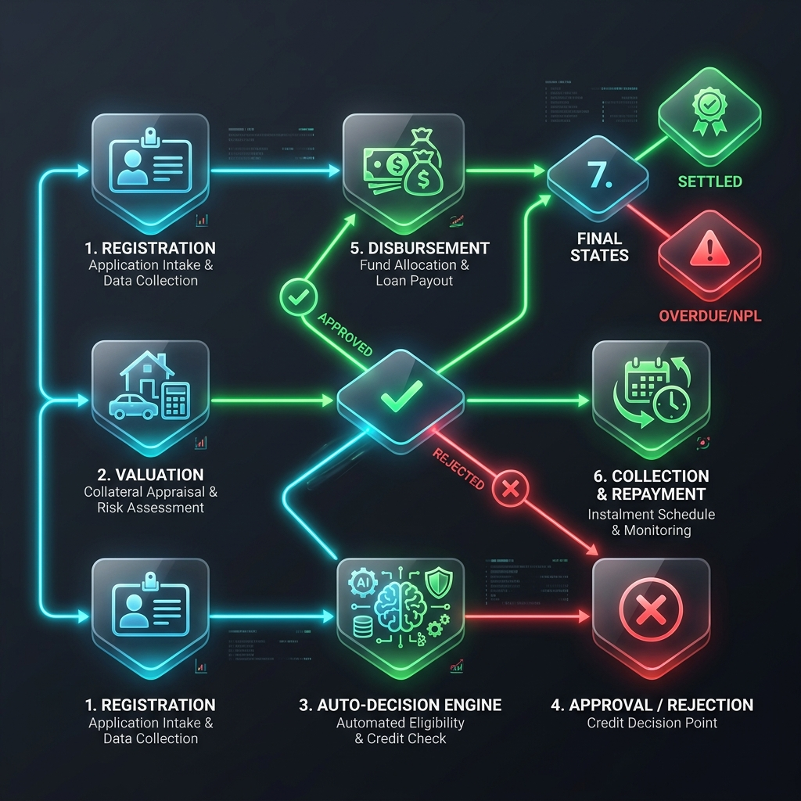
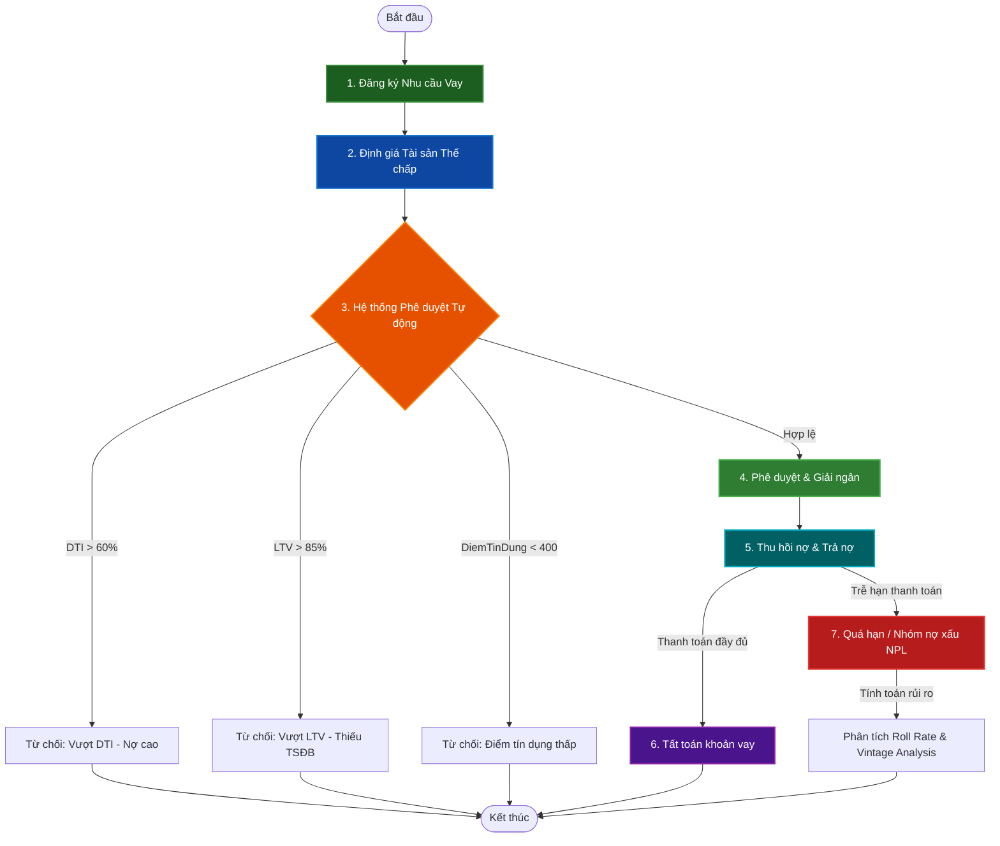
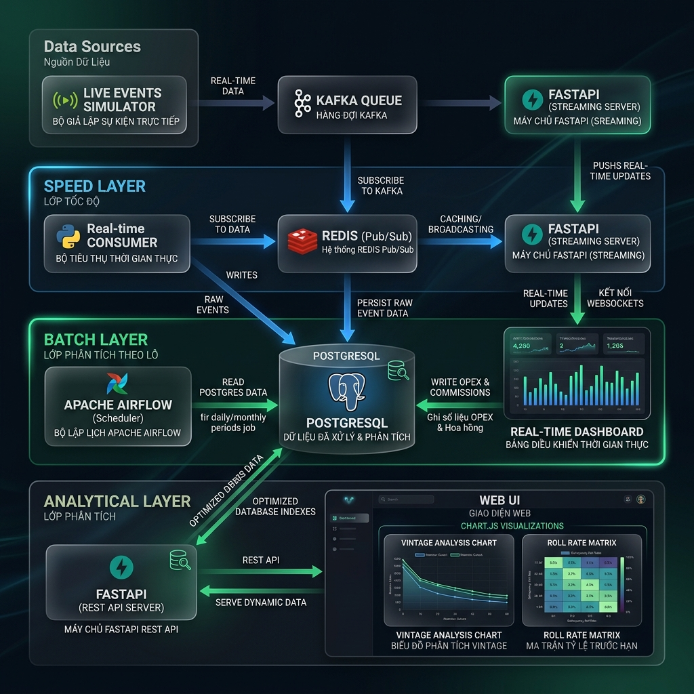
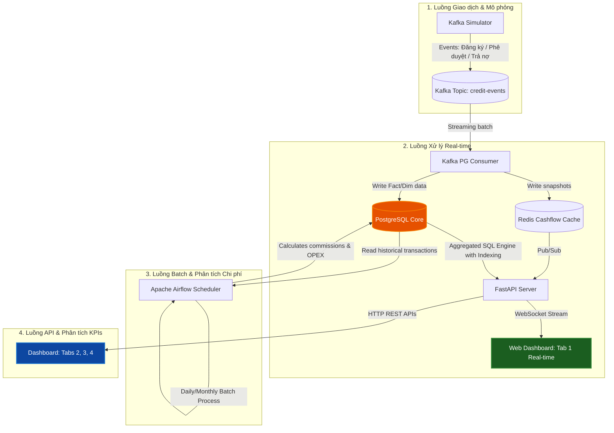
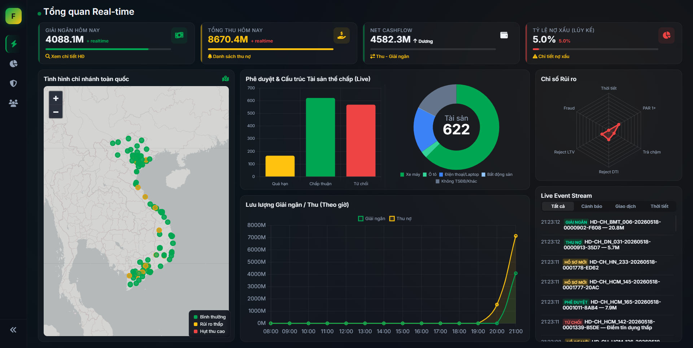
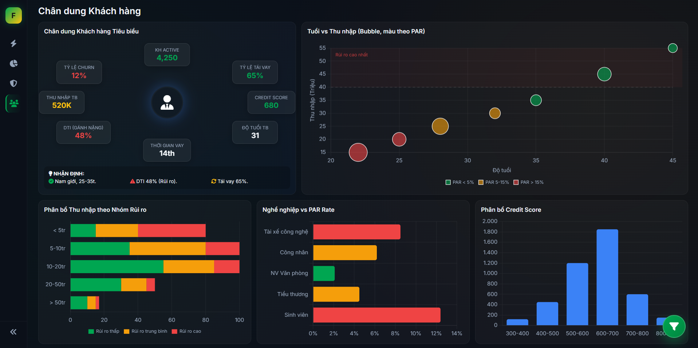
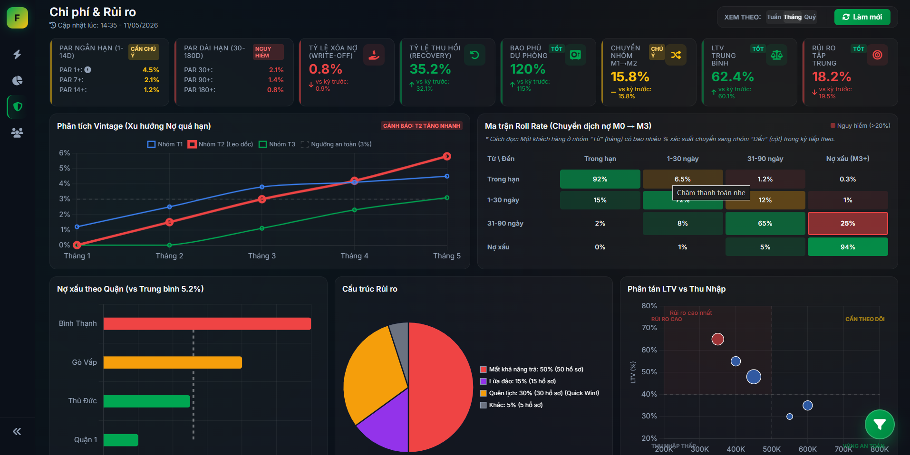
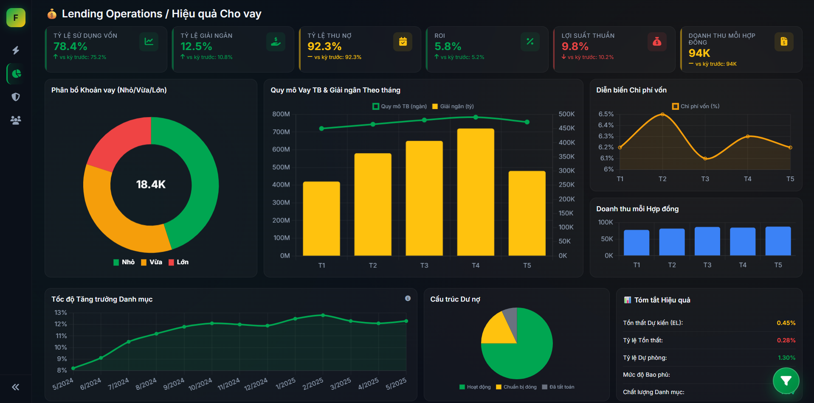

# 📊 Finnova Dashboard - Hệ Thống Quản Trị & Giám Sát Hoạt Động Tín Dụng Toàn Diện

Finnova Dashboard là giải pháp Lambda Architecture kết hợp luồng dữ liệu thời gian thực (Real-time Stream) và xử lý theo lô (Batch Processing) nhằm quản trị, đo lường toàn diện các hoạt động tín dụng, phân tích rủi ro, chân dung khách hàng, doanh thu và tối ưu hóa chi phí vận hành cho mạng lưới **800 cửa hàng tài chính tiện ích** trên toàn quốc.

---

## 📖 1. Nghiệp Vụ Bài Toán & Phương Pháp Giả Lập Dữ Liệu (Fake Data)

### 1.1 Nghiệp Vụ Tài Chính Tín Dụng của Finnova
Hệ thống quản lý toàn bộ vòng đời của các khoản vay thế chấp (xe máy, ô tô, điện thoại/laptop, bất động sản) và tín chấp với các nghiệp vụ cốt lõi:
1. **Quản lý Hợp đồng vay (Credit Lifecycle):** Đăng ký nhu cầu vay $\rightarrow$ Định giá tài sản thế chấp $\rightarrow$ Phê duyệt/Từ chối dựa trên điểm tín dụng (Credit Score) và hệ số chi trả nợ trên thu nhập (DTI - Debt-to-Income) $\rightarrow$ Giải ngân (Disbursement) $\rightarrow$ Thu nợ (Collection) $\rightarrow$ Tất toán (Settled) hoặc Quá hạn (Overdue/NPL).

#### Sơ đồ Quy trình Vòng đời Hợp đồng vay (Credit Lifecycle Workflow)




2. **Quản trị Rủi ro & Thu hồi nợ:** Phân loại nợ theo các nhóm quá hạn (M0: Trong hạn, M1: 1-14 ngày quá hạn, M2: 15-30 ngày, M3+: trên 30 ngày quá hạn). Thực hiện trích lập dự phòng rủi ro (Provisioning) dựa trên rủi ro từng nhóm nợ và phân tích tỷ lệ chuyển nhóm nợ (**Roll Rate Matrix**), phân tích tổn thất lũy kế theo nhóm giải ngân (**Vintage Analysis**).
3. **Quản trị Dòng tiền & Chi phí Hoạt động (OPEX & Payroll):** Ghi nhận dòng tiền thu/chi thực tế tại quỹ. Quản lý chi phí cố định (Mặt bằng, điện nước tại 800 cửa hàng), khấu hao tài sản văn phòng và chi phí nhân sự (lương cứng cùng hoa hồng thưởng tính động theo hiệu suất giải ngân và thu hồi nợ của từng nhân viên sale).


---

### 1.2 Phương Pháp Giả Lập Dữ Liệu (Data Simulator & Generator)
Để kiểm thử hiệu năng hệ thống ở quy mô lớn, dữ liệu được chia làm 2 luồng giả lập độc lập:

#### A. Luồng Giao Dịch Thời Gian Thực (Real-time Transaction Simulator)
Chạy bằng tiến trình Python chạy liên tục (`kafka-simulator`), tự động mô phỏng hành vi thực tế của hệ thống Core Banking:
- **Tạo Hồ sơ mới:** Đăng ký thông tin khách hàng ngẫu nhiên với điểm tín dụng từ 300 - 850, định giá tài sản thế chấp tương ứng.
- **Hệ thống Phê duyệt Tự động (Auto-Decision Engine):**
  - **DTI > 60%:** Tự động từ chối hồ sơ vì lý do rủi ro tài chính cao (`Vượt DTI (Nợ cao)`).
  - **LTV (Tỷ lệ khoản vay / Giá trị định giá) > 85%:** Từ chối vì thiếu tài sản đảm bảo (`Vượt LTV (Tài sản)`).
  - **DiemTinDung < 400:** Từ chối vì lịch sử tín dụng xấu (`Điểm tín dụng thấp`).
  - Các hồ sơ hợp lệ khác sẽ chuyển sang trạng thái `Phê duyệt` và tự động `Giải ngân` sau 2 - 30 phút.
- **Mô phỏng Thanh toán & Quá hạn:** Tự động tạo sự kiện khách hàng trả nợ gốc/lãi hàng ngày, hoặc tự động chuyển trạng thái hợp đồng sang `Quá hạn nhẹ`, `Quá hạn`, `Nợ nghi ngờ` nếu trễ hẹn thanh toán.

#### B. Luồng Chi Phí & Nhân Sự Định Kỳ (Batch Cost Ingestion via Airflow)
Dữ liệu liên quan đến chi phí hoạt động và phân bổ tài sản nội bộ bắt buộc phải thực hiện qua pipeline của **Apache Airflow** (`generate_cost_data` DAG) để đảm bảo tính nhất quán nghiệp vụ:
- **Seed Dimensions (Khởi tạo danh mục):** Tự động tạo 2.400 nhân viên (1 Cửa hàng trưởng, 2 Giao dịch viên/Sales cho mỗi cửa hàng trong số 800 cửa hàng), danh mục tài sản văn phòng (laptop, máy in), nhà cung cấp và mã khoản mục chi phí.
- **Align Historical Keys (Liên kết lịch sử):** Quét ngược lại toàn bộ các giao dịch cũ được tạo bởi Simulator để ánh xạ các trường `NhanVien_Sale_Key` và `NguoiDuyet_Key` vốn bị `NULL` về đúng danh sách nhân sự đã seed tại cửa hàng đó.
- **Backfill 12 Tháng Chi Phí:**
  - **OPEX:** Sinh hóa đơn điện, nước, internet, tiền thuê mặt bằng hàng ngày cho 800 cửa hàng dựa trên hạng cửa hàng (Hạng A+, A, B, C...).
  - **Depreciation (Khấu hao):** Tính toán khấu hao hàng tháng cho các tài sản nội bộ tại chi nhánh.
  - **Payroll & Commission (Lương & Hoa hồng động):** Tính toán bảng lương hàng tháng cho 2.400 nhân sự. Hoa hồng được tính động: cộng thêm **0.5% trên tổng số tiền giải ngân thực tế** và **1.0% trên tổng số tiền thu hồi nợ thực tế** mà nhân viên đó thực hiện trong tháng.

---

## 📂 2. Cấu Trúc Thư Mục & Cấu Trúc Cơ Sở Dữ Liệu

### 2.1 Cấu Trúc Thư Mục Dự Án
```text
finnova/
├── asset/                          # Chứa các ảnh demo chụp màn hình Dashboard
├── be/                             # Mã nguồn Backend hệ thống
│   ├── airflow/
│   │   └── dags/
│   │       └── generate_cost_data_dag.py # Airflow DAG khởi tạo danh mục & backfill chi phí
│   ├── fastapi/
│   │   ├── main.py                 # FastAPI Web Server & Đăng ký Endpoints
│   │   ├── database.py             # Kết nối & Tiện ích thực thi SQL truy vấn PostgreSQL
│   │   └── dashboard_queries.py    # SQL Engine tính toán KPIs & Biểu đồ cho các Tab
│   ├── kafka/
│   │   ├── consumers/
│   │   │   └── pg_batch_consumer.py # Lưu trữ hàng loạt sự kiện từ Kafka vào CSDL Postgres
│   │   └── simulator/
│   │       └── main.py             # Tiến trình giả lập giao dịch thời gian thực
│   ├── Dockerfile                  # Cấu hình đóng gói Python App
│   ├── docker-compose.yaml         # Orchestration khởi tạo toàn bộ hạ tầng (Postgres, Kafka, Redis, Airflow)
│   └── requirements.txt            # Danh sách thư viện Python phụ thuộc
├── dashboard/                      # Giao diện Frontend Web Dashboard
│   ├── html/
│   │   ├── index.html              # Bố cục giao diện chính & Thanh menu chuyển Tab
│   │   ├── tab-realtime.html       # Tab 1: Tổng quan sự kiện Real-time
│   │   ├── tab-customer.html       # Tab 2: Chân dung khách hàng & Phân bổ thu nhập
│   │   ├── tab-revenue.html        # Tab 3: Doanh thu, ROI & Hiệu suất sử dụng vốn
│   │   └── tab-risk.html           # Tab 4: Ma trận Roll Rate, Vintage & NPL rủi ro
│   ├── js/
│   │   ├── common/
│   │   │   └── main.js             # Quản lý Timer vòng đời chuyển Tab (Auto-refresh 1 phút)
│   │   ├── realtime/
│   │   │   └── live.js             # Xử lý Websocket sự kiện trực tiếp & Bản đồ chi nhánh
│   │   ├── customer/
│   │   │   └── charts.js           # Khởi tạo mind-map chân dung KH & Biểu đồ phân bổ rủi ro
│   │   ├── revenue/
│   │   │   └── charts.js           # Khởi tạo KPIs tài chính & Biểu đồ tăng trưởng MoM
│   │   └── risk/
│   │       └── charts.js           # Render ma trận rủi ro dạng CSS Heatmap & Vintage curves
│   └── css/                        # Custom Vanilla CSS thiết kế tối cao (Dark Mode, Glassmorphism)
└── schema/
    └── schema.sql                  # Cấu trúc CSDL chuẩn của hệ thống tài chính tín dụng
```

---

### 2.2 Thiết Kế Cơ Sở Dữ Liệu (Database Schema)
Hệ thống sử dụng mô hình thiết kế **Star Schema (Sơ đồ hình sao)** chuẩn hóa cho kho dữ liệu (Data Warehouse):

#### Các bảng Chiều (Dimension Tables)
- `Dim_ThoiGian`: Lưu trữ lịch thời gian chi tiết theo ngày (`Date_Key` dạng `YYYYMMDD`), hỗ trợ lọc theo Thứ, Tuần, Tháng, Quý, Năm, Ngày lễ.
- `Dim_CuaHang`: Danh mục 800 cửa hàng, lưu địa chỉ, phân hạng cửa hàng (A+, A, B...) để làm căn cứ tính định mức chi phí.
- `Dim_NhanVien`: Danh sách 2.400 nhân sự làm việc tại hệ thống cửa hàng.
- `Dim_KhachHang`: Thông tin chân dung khách hàng, lịch sử điểm tín dụng, thu nhập, nghề nghiệp (Áp dụng SCD Type 2 để lưu lịch sử thay đổi).
- `Dim_TaiSan`: Thông tin loại tài sản thế chấp (Xe máy, ô tô...) và giá trị định giá.
- `Dim_LoaiHinh`: Cấu hình hình thức trả nợ (Gốc đều, góp đều) và loại hình vay.
- `Dim_TrangThai`: Nhóm phân loại trạng thái khoản vay (`Đang lưu hành`, `Đã tất toán`, `Quá hạn nhẹ`...) và nhóm nợ tương ứng.

#### Các bảng Sự kiện (Fact Tables)
- `Fact_GiaoDich`: Trái tim của Credit Mart, lưu trữ toàn bộ lịch sử hồ sơ vay, số tiền duyệt vay, lãi suất, kỳ hạn và nhân viên xử lý.
- `Fact_LichSuTrangThai`: Ghi nhận nhật ký kiểm toán (Audit Trail) mỗi khi một hợp đồng thay đổi trạng thái, làm căn cứ tính toán **Roll Rate Matrix** và **Vintage Analysis**.
- `Fact_LichSuTraNo`: Nhật ký thu hồi nợ chi tiết (gốc đã trả, lãi đã trả, phí phạt trễ hạn).
- `Fact_ThuChi`: Sổ quỹ tiền mặt/ngân hàng dòng tiền tổng thể.
- `Fact_ChiPhiHoatDong` (OPEX), `Fact_KhauHao`, `Fact_LuongThuong` (Payroll): Các sự kiện liên quan đến chi phí hoạt động của chi nhánh và doanh nghiệp.

---

## 🔄 3. Luồng Dữ Liệu Hệ Thống (Data Pipeline Architecture)

Finnova triển khai kiến trúc lai **Lambda Architecture** để giải quyết đồng thời hai bài toán: Phản hồi siêu tốc (Real-time) và Phân tích chuyên sâu chính xác (Batch Analysis).

### Sơ đồ Luồng Dữ liệu Lambda (Lambda Architecture Diagram)




### 3.1 Luồng Thời Gian Thực (Speed Layer via Kafka)
1. **Phát sự kiện:** Tiến trình `kafka-simulator` liên tục gửi các sự kiện giao dịch mới dưới dạng JSON vào topic `credit-events` trong Kafka.
2. **Ghi nhận sự kiện:** Trình tiêu thụ `pg_batch_consumer` đọc dữ liệu hàng loạt (micro-batching) từ Kafka:
   - Ghi trực tiếp các bản ghi giao dịch mới vào bảng `Fact_GiaoDich`, `Fact_LichSuTraNo` của CSDL PostgreSQL.
   - Đồng thời, cập nhật tổng số tiền giải ngân/thu nợ lũy kế trong ngày vào **Redis** để lưu trữ trạng thái đệm.
3. **Đẩy dữ liệu lên giao diện:** FastAPI duy trì kết nối WebSocket tới Dashboard. Mỗi khi nhận được thông báo Pub/Sub mới từ Redis, FastAPI lập tức đẩy bản tin giao dịch thô kèm KPIs tổng hợp lên Tab 1 ("Tổng quan Real-time") để cập nhật bản đồ mạng lưới chi nhánh và bảng log sự kiện trong vòng **dưới 1 giây**.

### 3.2 Luồng Tính Toán Trực Tiếp từ CSDL (Batch & Analytics Layer)
Đối với các Tab Phân tích sâu chuyên đề (Tab 2, 3, 4), dữ liệu cần độ chính xác tuyệt đối từ CSDL cốt lõi:
1. **Airflow Batch Processing:** Airflow định kỳ tính toán lương thưởng, khấu hao tài sản và hoa hồng động cho nhân viên dựa trên các giao dịch thực tế đã phát sinh, sau đó nạp ngược lại vào các bảng Fact chi phí.
2. **Aggregated API Engine:** Khi người dùng chuyển sang các Tab 2, 3, 4 hoặc nhấn nút "Làm mới", trình duyệt sẽ gửi yêu cầu HTTP REST tới các endpoint `/api/dashboard/customer`, `/api/dashboard/revenue`, `/api/dashboard/risk`.
3. **Tối ưu hóa Truy vấn & Chỉ mục (Indexes):** Hệ thống sử dụng các chỉ mục nâng cao đã cấu hình trên PostgreSQL (`idx_fact_giaodich_khachhang`, `idx_fact_giaodich_trangthai`, `idx_fact_giaodich_ngaygiangan`, `idx_fact_giaodich_cuahang`, `idx_dim_khachhang_nghenghiep`) để thực thi các câu lệnh SQL tổng hợp phức tạp (Vintage Analysis, Roll Rate Matrix) trong vòng **dưới 100 mili-giây**, trả về JSON có cấu trúc tối ưu cho Chart.js hiển thị trên UI.

---

## 🛠️ 4. Hướng Dẫn Cài Đặt & Vận Hành Hệ Thống

### 4.1 Yêu Cầu Hệ Thống (Prerequisites)
- Docker & Docker Compose (Khuyên dùng Docker Desktop phiên bản mới nhất).
- Git.
- Trình duyệt Web hiện đại hỗ trợ WebSocket và ES6.

---

### 4.2 Các Bước Triển Khai

#### Bước 1: Khởi động Toàn bộ Hạ tầng bằng Docker Compose
Mở Terminal tại thư mục `be/` và chạy lệnh sau để kéo các Image cần thiết và dựng 11 container dịch vụ đồng thời:
```bash
cd be
docker compose up -d
```

Các dịch vụ sẽ được thiết lập tự động:
- **`postgres-credit`** (Cổng `5432`): Lưu trữ cơ sở dữ liệu tín dụng lõi.
- **`postgres-airflow`**: Lưu trữ cấu trúc hoạt động của Airflow.
- **`redis`** (Cổng `6379`): Bộ đệm trạng thái dòng tiền real-time.
- **`kafka`** (Cổng `9092`), **`zookeeper`**: Hệ thống truyền nhận tin nhắn luồng sự kiện.
- **`kafka-ui`** (Cổng `8081`): Giao diện trực quan hóa các Topic của Kafka.
- **`kafka-pg-consumer`**: Tiến trình đồng bộ dữ liệu từ Kafka vào Postgres.
- **`kafka-simulator`**: Tiến trình liên tục mô phỏng sinh giao dịch giải ngân, trả nợ.
- **`fastapi-realtime`** (Cổng `8000`): REST API & WebSocket Server.
- **`f88-dashboard`** (Cổng `5500`): Máy chủ Nginx phân phối giao diện HTML/CSS/JS Dashboard.
- **`airflow-webserver`** (Cổng `8080`), **`airflow-scheduler`**: Quản lý lịch chạy các tác vụ Batch.

---

#### Bước 2: Khởi Tạo Cơ Sở Dữ Liệu Lần Đầu (Init Schema)
Để khởi tạo toàn bộ cấu trúc bảng và các mối quan hệ kho dữ liệu, thực hiện nạp file `schema.sql` vào container PostgreSQL:
```bash
docker exec -i postgres-credit psql -U admin -d credit_control < ../schema/schema.sql
```

---

#### Bước 3: Tạo Chỉ Mục Tối Ưu Hóa Truy Vấn (Database Indexing)
Chạy script Python để tạo các chỉ mục hỗ trợ truy vấn hiệu năng cao cho các Dashboard phân tích sâu:
```bash
# Cài đặt psycopg2 trên máy host nếu chưa có
pip install psycopg2-binary

# Thực thi tạo index
python ../C:\Users\ADMIN\.gemini\antigravity\brain\e1d522d2-b9c1-45df-9479-e9d800adf354\scratch\create_indexes.py
```
*(Hoặc bạn có thể truy cập psql và copy các lệnh `CREATE INDEX` ở phần 5 vào chạy trực tiếp).*

---

#### Bước 4: Kích Hoạt DAG Trên Airflow để Seed Danh Mục & Sinh Chi Phí
1. Truy cập vào trang quản trị Apache Airflow tại địa chỉ: [http://localhost:8080](http://localhost:8080) với tài khoản:
   - **Username:** `airflow`
   - **Password:** `airflow`
2. Tìm kiếm DAG có tên là `generate_cost_data`.
3. Bật kích hoạt (**Unpause**) DAG và nhấn biểu tượng **Trigger DAG** để bắt đầu chạy. DAG sẽ tuần tự khởi tạo 2.400 nhân viên chi nhánh, liên kết lịch sử mã hợp đồng và lập tức backfill 12 tháng dữ liệu chi phí hoạt động vào PostgreSQL.

---

#### Bước 5: Trải Nghiệm Dashboard
Mở trình duyệt và truy cập địa chỉ: [http://localhost:5500](http://localhost:5500). Bạn sẽ thấy dòng tiền, giao dịch và bản đồ chi nhánh cập nhật liên tục theo thời gian thực! Click các Tab Phân tích để xem báo cáo KPIs chuyên sâu.

---

## 🖥️ 5. Demo Dashboard Đã Thiết Lập & Minh Họa Thực Tế

Hệ thống được thiết kế với giao diện cao cấp, phối tông màu tối sang trọng (**Premium Dark Theme**) kết hợp hiệu ứng kính phủ mờ (**Glassmorphism**) mang phong cách hiện đại hàng đầu.

Dưới đây là các giao diện màn hình chụp thực tế của các Tab được lưu trữ trực tiếp trong thư mục `asset/`:

### 5.1 Tab 1: Tổng quan Thời gian thực (Real-time Overview)
Hiển thị luồng giao dịch trực tiếp giải ngân, phê duyệt, từ chối nạp trực tiếp qua Kafka. Bản đồ nhiệt trực quan hóa mạng lưới 800 chi nhánh trên toàn quốc và radar quét rủi ro thời tiết cùng NPL ròng.


---

### 5.2 Tab 2: Phân Tích Chân Dung Khách Hàng (Customer Portrait)
Biểu thị bản đồ tư duy (Mind-map) tỏa lan về các chỉ số trung bình của khách hàng tín dụng của chuỗi cửa hàng (Credit Score, độ tuổi, DTI, thu nhập trung bình). Tích hợp các biểu đồ phân tích sâu về mối tương quan giữa thu nhập, độ tuổi và rủi ro quá hạn.


---

### 5.3 Tab 3: Báo Cáo Hiệu Suất & Doanh Thu (Revenue & Yield)
Báo cáo chi tiết các chỉ số tài chính vận hành cốt lõi: Tỷ lệ sử dụng vốn trên nguồn vốn 10 tỷ VND, ROI ròng (Lợi nhuận thu hồi / Chi phí opex & lương), biên lợi nhuận danh nghĩa (Yield) so sánh với chi phí sử dụng vốn và tốc độ tăng trưởng quy mô tín dụng thực tế qua các tháng.


---

### 5.4 Tab 4: Báo Cáo Chi Phí & Quản Trị Rủi Ro (Cost & Credit Risk)
Hiển thị các chỉ báo cảnh báo sớm rủi ro tín dụng (PAR 1+ đến PAR 180+), tỷ lệ thu hồi nợ xấu sau xử lý rủi ro và **Ma trận Hệ số chuyển nhóm nợ dạng CSS Heatmap** sinh động, kèm theo biểu đồ đường cong tổn thất tích lũy **Vintage Analysis** chuẩn xác theo thời gian thực tế của các nhóm giải ngân.

