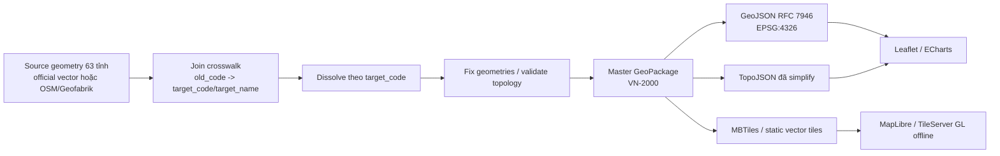

# Báo cáo xây dựng bản đồ Việt Nam offline theo 34 đơn vị hành chính cấp tỉnh

## Tóm tắt điều hành

Kể từ ngày 12/6/2025, entity["country","Việt Nam","quốc gia Đông Nam Á"] có 34 đơn vị hành chính cấp tỉnh, gồm 28 tỉnh và 6 thành phố; chính quyền địa phương của các tỉnh, thành phố hình thành sau sắp xếp chính thức hoạt động từ ngày 1/7/2025. Từ ngày 1/7/2025, Quyết định 19/2025/QĐ-TTg quy định thống nhất danh mục và mã số cho 34 đơn vị cấp tỉnh này. citeturn28view0turn29view0turn45view0

Nếu mục tiêu của bạn là **không phụ thuộc vào map API bên ngoài**, đường đi bền vững nhất là: lấy **nguồn pháp lý chính thức** làm “source of truth” cho tên/mã/quan hệ sáp nhập; lấy **geometry** từ nguồn vector phù hợp nhất mà bạn có thể khai thác hợp pháp; sau đó dựng một pipeline nội bộ để hợp nhất từ dataset 63 tỉnh cũ thành 34 tỉnh mới, làm sạch topology, đơn giản hóa cho web, và phát hành đồng thời bản **GeoJSON**, **TopoJSON** và tùy chọn **vector tiles/MBTiles** để dùng hoàn toàn offline. citeturn45view0turn12view1turn33search0turn34search6turn38view0turn39view0

Về mặt nguồn dữ liệu, **nguồn nhà nước Việt Nam** là chuẩn pháp lý cao nhất nhưng trong các tài liệu công khai tôi kiểm tra, cơ quan nhà nước hiện công bố bản đồ hành chính Việt Nam cập nhật 34 đơn vị dưới dạng **trực tuyến** và **PDF**; vector production-grade có thể cần đi theo thủ tục “cung cấp thông tin, dữ liệu, sản phẩm đo đạc và bản đồ” thay vì tải ẩn danh như một gói GeoJSON/Shapefile mở. Trong các nguồn quốc tế miễn phí, **OSM/Geofabrik** thực dụng nhất cho dự án web/offline nhưng chịu ràng buộc **ODbL**; **GADM** không phù hợp nếu bạn cần phát hành/kinh doanh tự do vì hạn chế thương mại và phân phối lại; **Natural Earth** thuận tiện và cực dễ dùng nhưng là dữ liệu bản đồ thế giới ở tỷ lệ nhỏ, phù hợp nền nhìn toàn quốc hơn là ranh giới pháp lý chi tiết. citeturn29view0turn14search1turn21view1turn16view2turn24search0turn24search4turn23search3turn44search16

Khuyến nghị triển khai thực tế là: **giữ bộ quy tắc sáp nhập và mã tỉnh trong một file cấu hình versioned**, chạy merge tự động bằng urlQGISturn35search1 hoặc urlGDAL / ogr2ogrturn33search0, chỉ dùng urlTurf.jsturn33search1 cho pipeline JavaScript khi bạn đã xử lý rõ trường hợp đa đa giác của các tỉnh ven biển/đảo, sau đó xuất bản một bản **master** không giản lược và một bản **web** đã tối ưu. citeturn33search1turn36search0turn42search0turn34search6

## Cơ sở pháp lý và nguồn dữ liệu

Về mặt pháp lý và chuẩn hóa, ba văn bản quan trọng nhất cho bài toán này là: Nghị quyết của Quốc hội về sắp xếp đơn vị hành chính cấp tỉnh năm 2025; Quyết định 19/2025/QĐ-TTg về danh mục và mã số đơn vị hành chính; và QCVN 80:2024/BTNMT về bản đồ hành chính. QCVN 80 quy định bản đồ hành chính được thành lập trong hệ tọa độ quốc gia VN-2000 và phải cập nhật khi có thay đổi về địa giới, tên gọi, cấp quản lý, hay vị trí trụ sở hành chính. citeturn28view0turn45view0turn12view0turn12view1

Trong các nguồn công khai của Nhà nước, Chính phủ cho biết Cục Đo đạc, Bản đồ và Thông tin địa lý Việt Nam đã hoàn thành bản đồ hành chính Việt Nam tỷ lệ 1:1.000.000 trực tuyến và bản đồ số PDF để phục vụ bộ máy quản lý sau sắp xếp; người dùng có thể tra cứu qua cổng VNSDI. Song song, thủ tục chính thức để được cung cấp dữ liệu đo đạc và bản đồ vẫn tồn tại như một dịch vụ hành chính công riêng. Điều này có nghĩa là, trên phương diện vận hành thực tế, bạn nên tách bạch giữa **“có thông tin chính thức”** và **“có gói vector mở để tải ngay”**. citeturn29view0turn14search1turn21view1turn16view2

Bảng dưới đây so sánh bốn họ nguồn mà bạn yêu cầu, cộng thêm hai kênh OSM rất hữu ích khi bạn cần ra GeoJSON nhanh. Các nhận định “dễ dùng” và “phù hợp cho 34 tỉnh” là đánh giá triển khai thực tế, còn phần định dạng và giấy phép/pháp lý bám theo tài liệu gốc. citeturn29view0turn24search0turn24search4turn23search3turn26search10turn44search16

| Nguồn | Tải / tra cứu ở đâu | Định dạng công khai dễ thấy | Giấy phép / pháp lý | Độ phù hợp cho bài toán 34 tỉnh |
|---|---|---|---|---|
| Nhà nước Việt Nam | urlVNSDIturn7search6, urlBản đồ sáp nhập hành chính 2025turn11search3, urldịch vụ cung cấp dữ liệu đo đạc và bản đồturn14search1 | Web tra cứu + PDF; vector có khả năng phải xin cấp theo thủ tục | Dữ liệu đo đạc và bản đồ là tài sản công; dữ liệu địa giới hành chính và bản đồ hành chính được cung cấp rộng rãi nếu không thuộc bí mật nhà nước, nhưng việc khai thác/sử dụng vẫn theo pháp luật chuyên ngành, mục đích sử dụng và chi phí; không thấy công bố theo kiểu CC/ODbL trên các trang tôi kiểm tra | **Cao nhất** về tính pháp lý; **không phải lúc nào tiện nhất** để tải vector trực tiếp citeturn29view0turn21view1turn16view2turn19view0 |
| GADM | urlGADM portalturn47search0, urlGADM Vietnam pageturn23search0 | Portal country download; cần chuẩn bị bước convert nếu muốn GeoJSON web-ready | Miễn phí cho học thuật và phi thương mại; không cho phân phối lại hoặc dùng thương mại nếu chưa có phép | Chỉ nên dùng như nguồn phụ/đối chiếu; trang Vietnam của GADM tôi kiểm tra vẫn hiển thị 65 first-level subdivisions nên không nên xem là nguồn authoritative cho 34 tỉnh citeturn24search0turn23search0turn43search18 |
| Natural Earth | urlNatural Earthturn24search4, url10m admin-1 states/provincesturn25search0 | Vector download ở tỷ lệ 1:10m/1:50m/1:110m | Public domain theo mô tả của dự án | Rất tốt cho nền bản đồ toàn quốc hoặc dashboard zoom thấp; **không nên** dùng làm ranh giới hành chính pháp lý chi tiết. Riêng lớp admin-1 10m còn được ghi chú là “beta” citeturn24search4turn25search0turn43search7 |
| OSM / Geofabrik | urlGeofabrik Vietnam downloadturn23search3, urlOSM licenceturn44search16 | `.osm.pbf`, `.shp.zip`, `.gpkg.zip` | ODbL 1.0; bắt buộc attribution, và derivative database có nghĩa vụ share-alike trong các trường hợp áp dụng | Miễn phí, cực thực dụng, cập nhật thường xuyên; rất hợp cho offline/web nếu bạn chấp nhận ODbL và tự QA lại 34 tỉnh theo nguồn chính thức citeturn23search3turn44search16turn44search1 |
| Overpass Turbo | urlOverpass Turboturn26search0 | Export GeoJSON từ truy vấn OSM | Theo license của OSM | Hợp để xuất nhanh GeoJSON boundary; không lý tưởng cho pipeline sản xuất lớn vì phụ thuộc truy vấn và chất lượng tagging citeturn26search0turn48search5turn44search16 |
| OSM-Boundaries | urlOSM-Boundaries docsturn26search10 | Boundary extraction từ OSM | Docs nêu rõ dữ liệu tải về theo license của OpenStreetMap | Tốt để lấy boundary sạch hơn Overpass cho use case hành chính, nhưng vẫn phải tuân ODbL và vẫn cần đối chiếu nguồn chính thức Việt Nam citeturn26search10turn44search16 |

Nếu bạn cần một **điểm cân bằng giữa “miễn phí” và “có thể dùng ngay”**, lựa chọn thực tiễn nhất là: **OSM/Geofabrik cho geometry + nguồn chính thức Việt Nam cho tên/mã/quy tắc sáp nhập**. Nếu bạn cần **độ pháp lý tối đa**, hãy theo đường **vector chính thức được cấp** từ cơ quan nhà nước và chỉ dùng nguồn mở như lớp đối chiếu QA. citeturn29view0turn14search1turn45view0turn23search3

Các link demo/tra cứu hữu ích để đối chiếu trực quan gồm: urlVNSDIturn7search6 và urlBản đồ sáp nhập hành chính 2025turn11search3. Đây không thay thế pipeline dữ liệu nội bộ của bạn, nhưng rất hữu ích để QA hình dạng, tên gọi và trực quan hóa kết quả. citeturn29view0turn11search3

## Danh mục 34 tỉnh thành và mã chính thức

Quyết định 19/2025/QĐ-TTg quy định mã số đơn vị hành chính cấp tỉnh là mã 2 chữ số, có tính ổn định trong suốt thời gian tồn tại của đơn vị; mã đã đóng thì không dùng lại cho đơn vị khác. Quyết định cũng nêu rõ nguyên tắc rất quan trọng cho pipeline merge: **khi nhập tỉnh, đơn vị hợp nhất mang mã của tỉnh nơi đặt trụ sở UBND tỉnh mới; mã của tỉnh còn lại bị đóng**. Điều này giải thích vì sao nhiều mã “mới” thực ra là mã tỉnh cũ của địa bàn đặt trụ sở hành chính. citeturn45view0

Bảng dưới đây tổng hợp danh mục 34 đơn vị cấp tỉnh theo mã chính thức và trạng thái “giữ nguyên / sáp nhập”. Mã lấy từ Quyết định 19/2025/QĐ-TTg; quan hệ sáp nhập lấy từ danh sách 34 đơn vị cấp tỉnh do Chính phủ công bố sau Nghị quyết của Quốc hội. Với nhóm “giữ nguyên”, cột “Nguồn hợp nhất” để trống có chủ ý. citeturn45view0turn29view0turn32view1

| Mã | Đơn vị | Loại | Trạng thái | Nguồn hợp nhất |
|---|---|---|---|---|
| 01 | entity["city","Hà Nội","Việt Nam"] | thành phố | giữ nguyên | — |
| 04 | entity["state","Cao Bằng","Việt Nam"] | tỉnh | giữ nguyên | — |
| 08 | entity["state","Tuyên Quang","Việt Nam"] | tỉnh | sáp nhập | Hà Giang + Tuyên Quang |
| 11 | entity["state","Điện Biên","Việt Nam"] | tỉnh | giữ nguyên | — |
| 12 | entity["state","Lai Châu","Việt Nam"] | tỉnh | giữ nguyên | — |
| 14 | entity["state","Sơn La","Việt Nam"] | tỉnh | giữ nguyên | — |
| 15 | entity["state","Lào Cai","Việt Nam"] | tỉnh | sáp nhập | Lào Cai + Yên Bái |
| 19 | entity["state","Thái Nguyên","Việt Nam"] | tỉnh | sáp nhập | Bắc Kạn + Thái Nguyên |
| 20 | entity["state","Lạng Sơn","Việt Nam"] | tỉnh | giữ nguyên | — |
| 22 | entity["state","Quảng Ninh","Việt Nam"] | tỉnh | giữ nguyên | — |
| 24 | entity["state","Bắc Ninh","Việt Nam"] | tỉnh | sáp nhập | Bắc Giang + Bắc Ninh |
| 25 | entity["state","Phú Thọ","Việt Nam"] | tỉnh | sáp nhập | Vĩnh Phúc + Hòa Bình + Phú Thọ |
| 31 | entity["city","Hải Phòng","Việt Nam"] | thành phố | sáp nhập | Hải Dương + Hải Phòng |
| 33 | entity["state","Hưng Yên","Việt Nam"] | tỉnh | sáp nhập | Thái Bình + Hưng Yên |
| 37 | entity["state","Ninh Bình","Việt Nam"] | tỉnh | sáp nhập | Hà Nam + Nam Định + Ninh Bình |
| 38 | entity["state","Thanh Hóa","Việt Nam"] | tỉnh | giữ nguyên | — |
| 40 | entity["state","Nghệ An","Việt Nam"] | tỉnh | giữ nguyên | — |
| 42 | entity["state","Hà Tĩnh","Việt Nam"] | tỉnh | giữ nguyên | — |
| 44 | entity["state","Quảng Trị","Việt Nam"] | tỉnh | sáp nhập | Quảng Bình + Quảng Trị |
| 46 | entity["city","Huế","Việt Nam"] | thành phố | giữ nguyên | — |
| 48 | entity["city","Đà Nẵng","Việt Nam"] | thành phố | sáp nhập | Đà Nẵng + Quảng Nam |
| 51 | entity["state","Quảng Ngãi","Việt Nam"] | tỉnh | sáp nhập | Kon Tum + Quảng Ngãi |
| 52 | entity["state","Gia Lai","Việt Nam"] | tỉnh | sáp nhập | Bình Định + Gia Lai |
| 56 | entity["state","Khánh Hòa","Việt Nam"] | tỉnh | sáp nhập | Ninh Thuận + Khánh Hòa |
| 66 | entity["state","Đắk Lắk","Việt Nam"] | tỉnh | sáp nhập | Phú Yên + Đắk Lắk |
| 68 | entity["state","Lâm Đồng","Việt Nam"] | tỉnh | sáp nhập | Đắk Nông + Bình Thuận + Lâm Đồng |
| 75 | entity["state","Đồng Nai","Việt Nam"] | tỉnh | sáp nhập | Bình Phước + Đồng Nai |
| 79 | entity["city","Thành phố Hồ Chí Minh","Việt Nam"] | thành phố | sáp nhập | Thành phố Hồ Chí Minh + Bà Rịa - Vũng Tàu + Bình Dương |
| 80 | entity["state","Tây Ninh","Việt Nam"] | tỉnh | sáp nhập | Long An + Tây Ninh |
| 82 | entity["state","Đồng Tháp","Việt Nam"] | tỉnh | sáp nhập | Tiền Giang + Đồng Tháp |
| 86 | entity["state","Vĩnh Long","Việt Nam"] | tỉnh | sáp nhập | Bến Tre + Trà Vinh + Vĩnh Long |
| 91 | entity["state","An Giang","Việt Nam"] | tỉnh | sáp nhập | Kiên Giang + An Giang |
| 92 | entity["city","Cần Thơ","Việt Nam"] | thành phố | sáp nhập | Cần Thơ + Sóc Trăng + Hậu Giang |
| 96 | entity["state","Cà Mau","Việt Nam"] | tỉnh | sáp nhập | Bạc Liêu + Cà Mau |

Trong bài toán kỹ thuật, bảng này nên được lưu thành **crosswalk chính thức** và đóng vai trò là nguồn sự thật duy nhất cho `target_code`, `target_name`, `target_type`, `effective_date`. Nếu source geometry của bạn vẫn theo 63 tỉnh cũ, chỉ cần join thêm `old_code` và dissolve theo `target_code`. Nếu source geometry không có mã hành chính chính thức, bạn vẫn có thể map theo tên, nhưng nên khóa thêm một lớp chuẩn hóa tên để tránh lỗi do thiếu dấu, tên tiếng Anh, hoặc biến thể như `TP HCM` / `Ho Chi Minh City`. citeturn45view0turn23search0

## Kiến trúc dữ liệu, hệ quy chiếu và pipeline xử lý

Khuyến nghị thực dụng là chia pipeline thành ba lớp. **Lớp master** dùng để chỉnh sửa và QA nên giữ ở GeoPackage, độ chính xác đầy đủ, chưa simplify. **Lớp publish** cho web nên xuất ra GeoJSON RFC 7946 ở WGS84 để tương thích rộng. **Lớp tối ưu hiệu năng** có thể là TopoJSON hoặc MBTiles/vector tiles nếu cần zoom, pan, hover mượt hơn hoặc phục vụ nhiều bản đồ cùng lúc. GeoJSON theo RFC 7946 dùng WGS84, đơn vị độ thập phân; EPSG:3857 phù hợp cho web mapping/visualization; còn theo chuẩn bản đồ hành chính Việt Nam, dữ liệu gốc hành chính vẫn nên được quản lý trong VN-2000. citeturn41search0turn41search1turn12view0turn12view1

Một kiến trúc phát hành hợp lý là:

- `master.gpkg` — dữ liệu chuẩn để biên tập, QA và tái dựng.
- `vietnam-provinces-34.geojson` — bản chuẩn để tích hợp thư viện front-end.
- `vietnam-provinces-34.topo.json` — bản nhẹ cho choropleth/toàn quốc.
- `vietnam-provinces-34.mbtiles` hoặc thư mục tile tĩnh — khi cần vector tiles offline. citeturn34search6turn38view0turn39view0



Pipeline này bám sát cả yêu cầu pháp lý lẫn thực tiễn frontend: chuẩn hóa bằng nguồn chính thức ở đầu pipeline, rồi phát hành ra nhiều “artifact” ở cuối pipeline thay vì cố dùng một file duy nhất cho mọi use case. Vì QCVN 80 yêu cầu cập nhật khi thay đổi về đơn vị hành chính, địa giới, tên gọi hoặc trụ sở, pipeline nên được thiết kế để **rebuild lặp lại được** chứ không phải xử lý thủ công một lần. citeturn12view1turn45view0

## Quy trình chuyển từ 63 tỉnh sang 34 tỉnh

Ở cấp tỉnh, **quan hệ sáp nhập đã được Nhà nước công bố**, nên bạn không cần tự đoán quy tắc merge. Điều nên làm là biến quan hệ đó thành một file cấu hình có thể version-control, vì source geometry thực tế có thể đến từ nhiều hệ khác nhau: mã hành chính cũ, tên tiếng Việt có dấu, ASCII không dấu, tên tiếng Anh, hoặc ID nội bộ kiểu GADM/OSM. citeturn29view0turn32view1turn45view0

Một cấu trúc cấu hình khuyến nghị là:

```json
{
  "02": {
    "target_code": "08",
    "target_name": "Tuyên Quang",
    "target_type": "tỉnh",
    "effective_date": "2025-07-01",
    "official_ref": "19/2025/QĐ-TTg"
  },
  "08": {
    "target_code": "08",
    "target_name": "Tuyên Quang",
    "target_type": "tỉnh",
    "effective_date": "2025-07-01",
    "official_ref": "19/2025/QĐ-TTg"
  },
  "10": {
    "target_code": "15",
    "target_name": "Lào Cai",
    "target_type": "tỉnh",
    "effective_date": "2025-07-01",
    "official_ref": "19/2025/QĐ-TTg"
  }
}
```

Khuyến nghị mạnh là **key cấu hình theo mã tỉnh cũ chính thức**, không key theo tên. Tên vẫn nên giữ như trường phụ để QA. Nếu source không có mã, hãy thêm bước chuẩn hóa tên trước khi join mapping; tốt nhất là phát sinh một cột `old_code` riêng rồi mới dissolve. citeturn45view0

### Phương án bằng QGIS

urlQGISturn35search1 hỗ trợ đầy đủ các bước quan trọng của pipeline này: kiểm tra validity, fix geometries, dissolve, validate/simplify coverage, và còn có thể export model thành Python để tự động hóa. Công cụ “Dissolve coverage” và “Simplify coverage” đặc biệt hữu ích khi lớp polygon của bạn đã là coverage có cạnh khớp nhau; nó được tối ưu cho union/simplify mà vẫn giữ coverage hợp lệ. citeturn42search6turn35search2turn36search0turn42search3turn35search11

Quy trình QGIS theo GUI nên đi như sau:

1. Nạp lớp 63 tỉnh vào project; kiểm tra CRS của lớp nguồn.
2. Thêm bảng `province-merge-map.csv` chứa `old_code,target_code,target_name,target_type,effective_date`.
3. Join bảng này vào layer 63 tỉnh theo `old_code`.
4. Chạy **Check validity**; nếu có lỗi thì chạy **Fix geometries** trước khi dissolve.
5. Chạy **Dissolve** theo `target_code,target_name,target_type`.
6. Chạy **Check validity** lại; nếu lớp là coverage tốt, cân nhắc **Dissolve coverage** hoặc **Simplify coverage** cho bước tối ưu.
7. Xuất ra `master.gpkg`, rồi xuất tiếp `GeoJSON` ở EPSG:4326 cho bản web. citeturn42search6turn35search2turn36search0turn33search0turn41search0

Đoạn PyQGIS tối thiểu để tự động hóa phần sau khi bạn đã join crosswalk vào layer nguồn:

```python
import processing

src = "data/source/vn63.gpkg|layername=provinces63_joined"

processing.run("native:fixgeometries", {
    "INPUT": src,
    "OUTPUT": "data/build/vn63_fixed.gpkg"
})

processing.run("native:dissolve", {
    "INPUT": "data/build/vn63_fixed.gpkg|layername=output",
    "FIELD": ["target_code", "target_name", "target_type"],
    "SEPARATE_DISJOINT": False,
    "OUTPUT": "data/build/vn34_raw.gpkg"
})

processing.run("native:checkvalidity", {
    "INPUT_LAYER": "data/build/vn34_raw.gpkg|layername=output",
    "METHOD": 2,
    "VALID_OUTPUT": "data/build/vn34_valid.gpkg",
    "INVALID_OUTPUT": "data/build/vn34_invalid.gpkg",
    "ERROR_OUTPUT": "data/build/vn34_errors.gpkg"
})
```

Đây là cách làm phù hợp nhất nếu bạn muốn **QA trực quan**, chỉnh tay vài ca khó như đảo, khe hở, polygon tự cắt, hay sai tên/mã trước khi đóng gói. citeturn42search6turn35search2turn36search3

### Phương án bằng GDAL và ogr2ogr

urlGDAL / ogr2ogrturn33search0 đặc biệt mạnh ở ba việc: chuyển đổi định dạng, tái chiếu, và thực thi các bước vector pipeline có thể lặp lại trong CI/CD. Bộ lệnh GDAL mới còn có `gdal vector make-valid`, `check-geometry`, `check-coverage` và `clean-coverage`, rất phù hợp để đưa vào pipeline build không cần GUI. citeturn33search0turn42search0turn42search1turn42search12

Một bộ lệnh mẫu, giả sử bạn đã có lớp 63 tỉnh với cột `old_code` và đã biết tên cột hình học thực tế, có thể viết như sau:

```bash
# Chuẩn hóa nguồn vào GeoPackage
ogr2ogr -f GPKG data/build/vn63_work.gpkg data/source/vn63.shp -nln provinces63

# Gắn target_code/target_name bằng CASE
ogr2ogr -f GPKG data/build/vn63_mapped.gpkg data/build/vn63_work.gpkg \
  -dialect sqlite \
  -sql "
    SELECT
      CASE
        WHEN old_code IN ('02','08') THEN '08'
        WHEN old_code IN ('10','15') THEN '15'
        WHEN old_code IN ('06','19') THEN '19'
        WHEN old_code IN ('53','48') THEN '48'
        WHEN old_code IN ('93','96') THEN '96'
        ELSE old_code
      END AS target_code,
      CASE
        WHEN old_code IN ('02','08') THEN 'Tuyên Quang'
        WHEN old_code IN ('10','15') THEN 'Lào Cai'
        WHEN old_code IN ('06','19') THEN 'Thái Nguyên'
        WHEN old_code IN ('53','48') THEN 'Đà Nẵng'
        WHEN old_code IN ('93','96') THEN 'Cà Mau'
        ELSE province_name
      END AS target_name,
      province_type AS target_type,
      geom
    FROM provinces63
  " -nln provinces63_mapped

# Dissolve theo target_code
ogr2ogr -f GPKG data/build/vn34_raw.gpkg data/build/vn63_mapped.gpkg \
  -dialect sqlite \
  -sql "
    SELECT
      target_code,
      target_name,
      target_type,
      ST_Union(geom) AS geom
    FROM provinces63_mapped
    GROUP BY target_code, target_name, target_type
  " -nln vn34

# Sửa invalid geometry
gdal vector make-valid data/build/vn34_raw.gpkg data/build/vn34_valid.gpkg

# Xuất GeoJSON chuẩn web
ogr2ogr -f GeoJSON data/dist/vietnam-provinces-34.geojson data/build/vn34_valid.gpkg \
  -t_srs EPSG:4326 -lco RFC7946=YES
```

Ở dự án thật, thay vì viết `CASE` dài trong shell, nên join một bảng mapping CSV/GPKG rồi mới dissolve. Điều đó khiến pipeline dễ review hơn, dễ cập nhật khi Nhà nước tiếp tục điều chỉnh mã hoặc tên. citeturn33search0turn42search0turn45view0

### Phương án bằng Turf.js và Node.js

urlTurf.jsturn33search1 phù hợp nếu toàn bộ stack của bạn là JavaScript và bạn muốn build chạy ngay trong Node.js. Tuy nhiên, docs của Turf nêu rõ `dissolve` chỉ hỗ trợ `FeatureCollection` của **Polygon**, không hỗ trợ **MultiPolygon** trong collection. Với địa giới tỉnh Việt Nam có biển đảo và đa đa giác, bạn nên **flatten MultiPolygon thành nhiều Polygon cùng `target_code`**, rồi mới dissolve; nếu dữ liệu rất phức tạp, GDAL/QGIS thường ổn định hơn. citeturn33search1turn33search5

Ví dụ merge bằng Node.js:

```js
import fs from 'node:fs';
import dissolve from '@turf/dissolve';
import { featureCollection, polygon } from '@turf/helpers';

const src = JSON.parse(fs.readFileSync('data/source/vn63.geojson', 'utf8'));
const mapping = JSON.parse(fs.readFileSync('config/province-merge-map.json', 'utf8'));

const polygonOnly = [];

for (const f of src.features) {
  const m = mapping[f.properties.old_code];
  if (!m) throw new Error(`Thiếu mapping cho old_code=${f.properties.old_code}`);

  const props = {
    old_code: f.properties.old_code,
    source_name: f.properties.name,
    target_code: m.target_code,
    target_name: m.target_name,
    target_type: m.target_type,
    effective_date: m.effective_date
  };

  if (f.geometry.type === 'Polygon') {
    polygonOnly.push({ ...f, properties: props });
  } else if (f.geometry.type === 'MultiPolygon') {
    for (const coords of f.geometry.coordinates) {
      polygonOnly.push(polygon(coords, props));
    }
  } else {
    throw new Error(`Unsupported geometry type: ${f.geometry.type}`);
  }
}

const merged = dissolve(featureCollection(polygonOnly), {
  propertyName: 'target_code'
});

for (const f of merged.features) {
  const m = Object.values(mapping).find(x => x.target_code === f.properties.target_code);
  Object.assign(f.properties, {
    target_name: m.target_name,
    target_type: m.target_type,
    effective_date: m.effective_date
  });
}

fs.writeFileSync('data/build/vn34.raw.geojson', JSON.stringify(merged));
```

Một build script Node.js nhỏ để xuất cả GeoJSON lẫn TopoJSON:

```js
import fs from 'node:fs';
import { topology } from 'topojson-server';

const geojson = JSON.parse(fs.readFileSync('data/build/vn34.valid.geojson', 'utf8'));
fs.writeFileSync('data/dist/vietnam-provinces-34.geojson', JSON.stringify(geojson));

const topo = topology({ provinces: geojson });
fs.writeFileSync('data/dist/vietnam-provinces-34.topo.json', JSON.stringify(topo));
```

TopoJSON được thiết kế để mã hóa topology bằng các cung biên dùng chung, nên thường nhẹ hơn GeoJSON và tránh lặp lại ranh giới giữa hai tỉnh kề nhau. Nếu bạn chỉ cần choropleth toàn quốc với 34 polygon, đây thường là định dạng phát hành tốt nhất cho web. citeturn34search1turn34search6turn34search2

## Làm sạch hình học, tối ưu web và phát hành offline

Làm sạch geometry nên được xem là bước bắt buộc, không phải bước phụ. Tối thiểu, bạn nên chạy một vòng **validity check**, sửa invalid geometry, sau đó kiểm tra coverage để phát hiện khe hở, chồng lấn và cạnh không trùng nhau. GDAL có `check-geometry`, `make-valid`, `check-coverage`, `clean-coverage`; QGIS có `Check validity`, `Fix geometries`, `Validate coverage`, `Simplify coverage`. citeturn42search0turn42search1turn42search12turn42search6turn36search0

Với tham số cụ thể, nên duy trì ít nhất ba profile:

- **Master**: không simplify, chỉ fix invalid geometry.
- **Web-medium**: simplify có topology-aware ở mức vừa phải, đủ giảm dung lượng nhưng không làm mất hình dạng tỉnh.
- **Tiles**: tiếp tục simplify/quantize ở mức cao hơn nếu đi vào vector tiles.

Một bộ tham số khởi điểm thực dụng cho lớp 34 tỉnh là:

- simplify coverage / topo simplify ở mức **nhẹ đến vừa**;
- mục tiêu phát hành cho choropleth toàn quốc là **giảm dung lượng** thay vì giữ từng chi tiết bờ biển nhỏ;
- luôn giữ một bản `master` không đơn giản hóa để tái sinh mọi bản còn lại.

Bảng công cụ dưới đây tóm tắt điểm mạnh/yếu cho đúng bài toán “63 → 34 → web/offline”. citeturn33search0turn33search1turn33search10turn34search6turn36search0

| Công cụ | Mạnh ở đâu | Điểm yếu chính | Khi nên dùng |
|---|---|---|---|
| urlQGISturn35search1 | GUI mạnh, QA trực quan, modeler, công cụ validity/coverage đầy đủ | Kém gọn hơn CLI cho CI/CD thuần tự động | Khi cần vừa biên tập tay vừa xuất pipeline lặp lại citeturn42search6turn36search0turn35search11 |
| urlGDAL / ogr2ogrturn33search0 | Chuyển đổi định dạng, SQL dissolve, make-valid, kiểm tra geometry/coverage | Ít trực quan; câu lệnh dài dễ khó đọc nếu không tách config | Khi build server-side, CI/CD, batch conversion citeturn42search0turn42search12 |
| urlTurf.jsturn33search1 | Dễ tích hợp trong Node/web stack JS | `dissolve` không hỗ trợ MultiPolygon trong collection | Khi toàn bộ stack là JS và bạn kiểm soát tốt hình học đầu vào citeturn33search1turn33search5 |
| urlTopoJSONturn34search6 | Nhẹ, topology-aware, rất hợp choropleth/offline | Thường cần bước convert phụ so với GeoJSON | Khi bản đồ chủ yếu là nền ranh giới 34 tỉnh toàn quốc citeturn34search6turn34search2turn34search5 |
| urlmapshaperturn33search10 | Clean, simplify, dissolve, xuất TopoJSON/GeoJSON rất nhanh | Không thay thế hoàn toàn QA topology pháp lý | Khi cần bước hậu xử lý web-friendly cực nhanh citeturn33search10 |

Một chuỗi lệnh hậu xử lý khuyến nghị:

```bash
# Tạo bản web nhẹ hơn
npx mapshaper data/dist/vietnam-provinces-34.geojson \
  -clean \
  -simplify weighted 7% keep-shapes \
  -o format=geojson precision=0.000001 data/dist/vietnam-provinces-34.web.geojson

# Tạo TopoJSON
npx mapshaper data/dist/vietnam-provinces-34.geojson \
  -clean \
  -simplify weighted 7% keep-shapes \
  -o format=topojson data/dist/vietnam-provinces-34.web.topo.json
```

Nếu bạn muốn vector tiles offline, urlTippecanoeturn34search8 hỗ trợ ghi ra `.mbtiles`, `.pmtiles` hoặc ghi trực tiếp ra **thư mục tiles tĩnh** bằng `-e`. citeturn38view0

```bash
# MBTiles
tippecanoe -o data/tiles/vn34.mbtiles \
  -l provinces \
  -Z0 -z8 \
  --coalesce-densest-as-needed \
  data/dist/vietnam-provinces-34.web.geojson

# Tiles tĩnh để serve như file
tippecanoe -e data/tiles/static \
  -l provinces \
  -Z0 -z8 \
  data/dist/vietnam-provinces-34.web.geojson
```

Để chạy local tile server hoàn toàn offline, urlTileServer GLturn33search3 có thể phục vụ trực tiếp file MBTiles bằng Node hoặc Docker. Tài liệu chính thức của dự án nêu luôn ví dụ `docker run` với `--file your.mbtiles`. citeturn39view0turn39view2turn39view3

```bash
docker run --rm -it \
  -v $(pwd)/data/tiles:/data \
  -p 8080:8080 \
  maptiler/tileserver-gl:latest \
  --file vn34.mbtiles
```

Với frontend, lời khuyên ngắn gọn là:

- **Leaflet**: nếu chỉ cần 34 polygon, dùng trực tiếp GeoJSON/TopoJSON là đủ. citeturn40search0turn40search8
- **MapLibre GL JS**: dùng GeoJSON source cho bản đơn giản; dùng vector tiles nếu muốn mượt hơn và giữ nhiều lớp hơn. MapLibre dùng tọa độ WGS84 theo thứ tự `[lng, lat]`. citeturn41search2turn41search14
- **Apache ECharts**: từ v5 không còn map GeoJSON built-in; bạn phải `registerMap` với dữ liệu GeoJSON hay SVG của riêng mình. citeturn40search9turn40search5turn40search1

## Kiểm thử, cấu trúc thư mục, CI/CD và bàn giao

Về kiểm thử, bài toán này không nên dừng ở việc “render được”. Tối thiểu bạn nên có bốn lớp test: **số feature = 34**, **tập mã đúng 34 mã chính thức**, **không có invalid geometry**, và **không có chồng lấn/khe hở ngoài ngưỡng cho phép** sau bước merge. Vì QCVN yêu cầu cập nhật bản đồ khi có thay đổi địa giới/tên/trụ sở, pipeline nên rebuild được từ đầu bất cứ lúc nào chỉ bằng source geometry + crosswalk + scripts. citeturn12view1turn45view0

Một cấu trúc thư mục dễ bảo trì:

```text
map-vn-34/
  config/
    province-merge-map.json
    province-codes-34.json
    sources.lock.json
  data/
    source/
    build/
    dist/
    tiles/
  scripts/
    build-vn34.mjs
    export-topo.mjs
    render-smoke.mjs
  test/
    province-count.test.mjs
    province-codes.test.mjs
    geometry-validity.test.mjs
  docs/
    REPORT.md
```

Một unit test Node.js rất cơ bản:

```js
import fs from 'node:fs';
import assert from 'node:assert/strict';

const data = JSON.parse(fs.readFileSync('data/dist/vietnam-provinces-34.geojson', 'utf8'));
const codes = data.features.map(f => f.properties.target_code).sort();

assert.equal(data.features.length, 34);
assert.equal(new Set(codes).size, 34);
assert.deepEqual(
  codes,
  ["01","04","08","11","12","14","15","19","20","22","24","25","31","33","37","38","40","42","44","46","48","51","52","56","66","68","75","79","80","82","86","91","92","96"]
);
```

Một smoke test render cho urlLeafletturn40search0:

```html
<div id="map" style="height: 480px"></div>
<script>
  const map = L.map('map').setView([16.2, 107.8], 5);
  fetch('./data/dist/vietnam-provinces-34.web.geojson')
    .then(r => r.json())
    .then(gj => L.geoJSON(gj, {
      style: () => ({ weight: 1, fillOpacity: 0.35 })
    }).addTo(map));
</script>
```

Một smoke test render cho urlMapLibre GL JSturn41search2:

```js
map.on('load', () => {
  map.addSource('vn34', {
    type: 'geojson',
    data: './data/dist/vietnam-provinces-34.web.geojson'
  });

  map.addLayer({
    id: 'vn34-fill',
    type: 'fill',
    source: 'vn34',
    paint: { 'fill-opacity': 0.35 }
  });

  map.addLayer({
    id: 'vn34-line',
    type: 'line',
    source: 'vn34',
    paint: { 'line-width': 1 }
  });
});
```

Một smoke test render cho urlApache EChartsturn40search1:

```js
import * as echarts from 'echarts/core';
import { MapChart } from 'echarts/charts';
import { GeoComponent, TooltipComponent } from 'echarts/components';
import { CanvasRenderer } from 'echarts/renderers';

echarts.use([MapChart, GeoComponent, TooltipComponent, CanvasRenderer]);

const geojson = await fetch('./data/dist/vietnam-provinces-34.web.geojson').then(r => r.json());
echarts.registerMap('vn34', geojson);

chart.setOption({
  tooltip: {},
  series: [{
    type: 'map',
    map: 'vn34',
    emphasis: { label: { show: true } }
  }]
});
```

Về CI/CD, một cách làm gọn là:

1. Pin rõ `effective_date`, `official_ref`, URL nguồn, checksum trong `sources.lock.json`.
2. Mỗi lần source boundary hoặc crosswalk thay đổi, chạy lại toàn bộ build.
3. Fail pipeline nếu feature count khác 34, mã không khớp danh sách chính thức, hoặc xuất hiện invalid geometry.
4. Lưu song song artifact `master`, `web`, `topo`, `tiles`.
5. Gắn metadata phát hành: ngày build, nguồn geometry, nguồn pháp lý, license áp dụng cho từng artifact.

Danh sách deliverable nên bàn giao cuối cùng:

- `province-merge-map.json`
- `province-codes-34.json`
- `vietnam-provinces-34.master.gpkg`
- `vietnam-provinces-34.geojson`
- `vietnam-provinces-34.web.geojson`
- `vietnam-provinces-34.web.topo.json`
- `vn34.mbtiles` hoặc `tiles/static/`
- `build-vn34.mjs` hoặc script GDAL/QGIS tương đương
- test tự động kiểm `34 feature + mã`
- tài liệu vận hành ngắn cho rebuild khi có thay đổi hành chính mới

Có hai giới hạn cần nói rõ. Thứ nhất, trong các nguồn công khai tôi kiểm tra, **đầu mối nhà nước đã công bố bản đồ trực tuyến/PDF**, nhưng **chưa thấy một link vector mở, ẩn danh, ổn định kiểu “click là tải GeoJSON/Shapefile 34 tỉnh”**; nếu bạn cần nguồn nhà nước làm geometry gốc, nhiều khả năng vẫn phải đi qua kênh cung cấp dữ liệu chính thức. Thứ hai, một số nguồn quốc tế như GADM và thậm chí một số nguồn OSM-derived có thể trễ nhịp so với mốc hành chính mới, nên **đừng lấy source mở làm chuẩn pháp lý**; hãy lấy chúng làm geometry candidate rồi ép về đúng theo bảng mã và quyết định chính thức của Việt Nam. citeturn29view0turn14search1turn23search0turn45view0